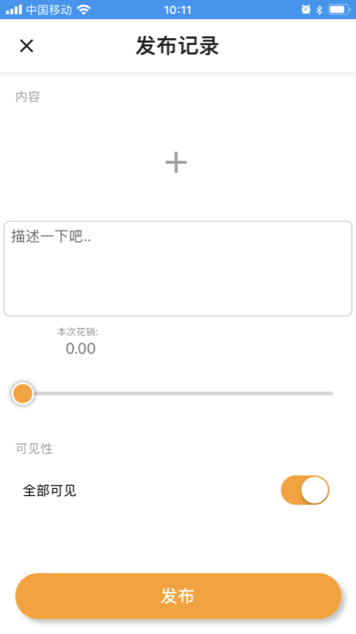

## xhz_app 一个基于 Flutter Go 的在线亲友记账共享 app

### 项目介绍
后端使用 golang gin gorm 开发，移动端使用 Flutter 构建。

### 项目结构

### FlutterApp截图
#### 登录

#### 注册

#### 首页

#### 我的信息

#### 发布

### 后端服务
详情见 [https://github.com/ogromwang/xhz](https://github.com/ogromwang/xhz)